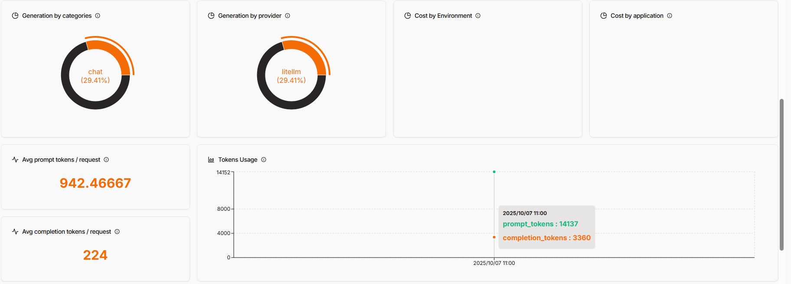

# CrewAI City Information Workflow with OpenLIT Monitoring

This project implements a multi-agent workflow using CrewAI to extract and validate parameters for the Open-Meteo Geocoding API, call the API, and summarize city information. It includes a gatekeeper agent that enforces query guardrails and provides user-facing guidance when the query is not acceptable. The application also includes OpenLIT monitoring for observability.

This project implements a multi-agent workflow using CrewAI to extract and validate parameters for the Open-Meteo Geocoding API, call the API, and summarize city information. It includes a gatekeeper agent that enforces query guardrails and provides user-facing guidance when the query is not acceptable.

## Features
- **Main Application** (`main.py`): Core workflow implementation with CrewAI agents
- **OpenLIT Integration**: Built-in observability and monitoring for the AI workflow
- **Docker Support**: Containerized setup for easy deployment and testing
- Guardrail agent that validates the user query (city-related and safe) and provides abstract user guidance when invalid
- Parameter extractor agent producing structured parameters via Pydantic
- Validator agent that consults the official Open-Meteo Geocoding API documentation
- API call to the public Open-Meteo Geocoding API (no API key required)
- Summarizer agent that outputs an engaging city overview
- Retries for parameter validation and API calls

## Architecture & Flow
High-level flow:
1. Gatekeeper checks if the input is city-related and safe
2. Parameter extractor parses the user query into geocoding search parameters (Pydantic model)
3. Validator verifies and corrects parameters against Open-Meteo docs (scraped with a tool)
4. API call is made to the Open-Meteo Geocoding API
5. Summarizer produces a structured narrative about the city

Agent roles:
- City Query Gatekeeper → returns `{ is_city_query, is_safe, safetyReason, returnMessageToUser }`
- City Query Parameter Extractor → returns `GeoSearchParams`
- Open-Meteo Geocoding Parameter Validator → returns `ValidationResult`
- City Information Summarizer → returns a concise, engaging summary

Core file:
- `main.py` – contains agent setup, tasks, and the `run_city_info_workflow` orchestration.

## Requirements
Install Python 3.11+.

### Dependencies
See `requirements.txt` for exact packages. The core libraries used:
- crewai
- crewai-tools
- python-dotenv
- requests
- pydantic

## Setup

### Prerequisites
- Python 3.11+
- Docker and Docker Compose (for containerized deployment)

### Local Development
1. Clone the repository and enter the project folder:
   ```bash
   git clone https://github.com/vitorjpc10/city-inquiry-ai-agent
   cd crew-ai-applications
   ```

2. (Optional but recommended) Create a virtual environment:
   ```bash
   python -m venv venv
   source venv/bin/activate  # On Windows: .\\venv\\Scripts\\activate
   ```

3. Install dependencies:
   ```bash
   pip install -r requirements.txt
   ```

4. Create a `.env` file and set your LLM key:
   ```env
   GEMINI_API_KEY=your_gemini_api_key_here
   # Optional default query
   CITY_QUERY=Tell me about San Francisco
   ```

### Docker Setup with OpenLIT

1. Ensure Docker and Docker Compose are installed on your system.

2. Navigate to the OpenLIT Docker directory:
   ```bash
   cd openlit_docker/openlit
   ```
   
   and
   ```bash
   git clone https://github.com/openlit/openlit.git
   ``` 

3. Start the OpenLIT monitoring service:
   ```bash
   docker-compose up -d
   ```
   This will start the following services:
   - OpenLIT UI (http://localhost:3000)
   - ClickHouse database
   - OpenTelemetry Collector

4. In a new terminal, navigate back to the project root and run the CrewAI application:
   ```bash
   # From the project root directory
   python main.py
   ```

5. Access the monitoring dashboard:
   - OpenLIT Dashboard: http://localhost:3000
   - Default credentials (if required):
     - Email: user@openlit.io
     - Password: openlituser

6. To stop the services:
   ```bash
   # From the openlit_docker/openlit directory
   docker-compose down
   ```
1. Clone the repository and enter the project folder.
2. (Optional but recommended) Create a virtual environment.
3. Install dependencies:
   ```bash
   pip install -r requirements.txt
   ```
4. Create a `.env` file and set your LLM key (CrewAI LLM wrapper is used):
   ```env
   GEMINI_API_KEY=your_gemini_api_key_here
   # Optional default query
   CITY_QUERY=Tell me about San Francisco
   ```

Note: The Open-Meteo Geocoding API itself does not require a key for non-commercial usage.

## Running the Application

You can run the workflow via:
```bash
python main.py
```

Environment variables:
- `CITY_QUERY` (optional): default question if not provided on runtime.
- `GEMINI_API_KEY` (required): LLM key for CrewAI’s `LLM` usage.

Program behavior:
- If the input is not city-related or deemed unsafe, the workflow prints a user-facing guidance (`returnMessageToUser`) and exits.
- On valid input, it extracts parameters, validates them, calls the API, and prints a summary.

## API Reference
This project uses the Open‑Meteo Geocoding API:
- Documentation: https://open-meteo.com/en/docs/geocoding-api#geocoding_search

Key endpoint:
```
GET https://geocoding-api.open-meteo.com/v1/search
```
Common parameters:
- `name` (required): place or city name
- `count` (optional, 1..100)
- `language` (optional, IETF code in lowercase)
- `countryCode` (optional, ISO-3166-1 alpha-2)

## Code Walkthrough
- `GeoSearchParams` (Pydantic): structured parameters for the API
- `ValidationResult` (Pydantic): `{ valid, params, reason }` returned by validator
- `QueryGateResult` (Pydantic): `{ is_city_query, is_safe, safetyReason, returnMessageToUser }`
- `build_agents`: creates gatekeeper, extractor, validator (with docs scraper), summarizer
- `make_*_task`: builds CrewAI tasks and enforces structured output via Pydantic models
- `run_city_info_workflow`: orchestrates gatekeeping → extraction → validation → API call → summarization with retries

## Temperature Settings
The temperature settings in the `create_llm()` function control the randomness and creativity of the output. A higher temperature setting will result in more varied and potentially more interesting output, but may also lead to less accurate or less relevant results. A lower temperature setting will result in more consistent and accurate output, but may be less engaging.

## Monitoring with OpenLIT

This application includes OpenLIT integration for monitoring your AI workflows. OpenLIT provides:
- Real-time monitoring of AI model usage and performance
- Detailed metrics and analytics
- Integration with various LLM providers

### Accessing the OpenLIT Dashboard

1. Ensure the OpenLIT service is running (from the `openlit_docker/openlit` directory)
2. Open your browser to `http://localhost:3000`
3. Log in with the default credentials if prompted:
   - Email: user@openlit.io
   - Password: openlituser

### Key Features

- **Real-time Metrics**: Monitor API calls, latency, and token usage
- **Error Tracking**: Identify and debug issues in your AI workflows
- **Cost Analysis**: Track usage and costs across different models
- **Custom Dashboards**: Create views specific to your monitoring needs

For more information about OpenLIT monitoring, visit the [official documentation](https://docs.crewai.com/en/observability/openlit).

## Troubleshooting
- If you see import warnings for CrewAI or tools, ensure dependencies are installed: `pip install -r requirements.txt`.
- If the LLM returns unstructured text, confirm you are using the task's Pydantic structured output.
- If the output is too rigid or too random, adjust the temperature settings in the `create_llm()` function.
- API failures: the workflow retries automatically; check network connectivity and parameter validity.
- If the output is not as expected, consider adjusting the temperature settings in the `create_llm()` function based on the agent's role and requirements.

## OpenLit Dashboard Screenshots




## Response Example
